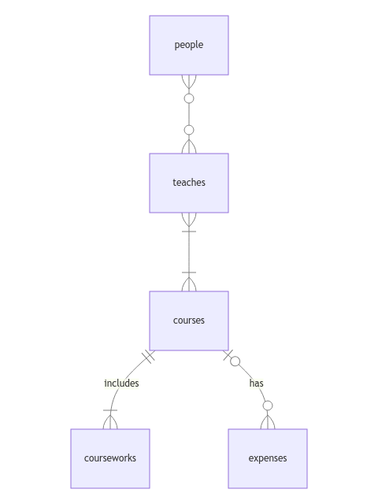

# Design Document

By Genrev Aguilar

Video overview: [CS50 SQL - Final Project - university.db](https://youtu.be/3Yuy_Qh2gVY?si=NeVjWWtJSKchAKZT)

## Scope

The database for this CS50 SQL project includes the necessary tables to keep track of the information or data we might want to remember when we study at our university. The database includes the following entities:

* People, including basic information about the people we met at the university.
* Courses, including basic information about the courses we took/will take at the university.
* Teaches, which is a junction table that relates people who are instructors and courses.
* Courseworks, which contains information about the courseworks included in a course.
* Expenses, containing information about our expenses for a specific course and/or year level.

Out of scope are elements like faculties, school places, school events, and extracurricular activities.

## Functional Requirements

This database will support:

* CRUD operations for people, courses, courseworks, and expenses.
* Tracking of all the courseworks and expenses for a certain course and/or year level.
* Managing instructors and courses, allowing for multiple instructors per course and multiple courses per instructor.

## Representation

Entities are represented in SQLite using the following table schema.

### Entities

The database includes the following entities:

#### People

The `people` table includes:

* `id`, which serves as the unique identifier for people, is of type `INTEGER`. This column has the `PRIMARY KEY` constraint applied.
* `first_name`, which specifies the first name of a person we met at the university, is of type `TEXT`, appropriate for storing characters or strings like names.
* `last_name`, which specifies the last name of a person we met at the university, is also of type `TEXT`.
* `gender`, which specifies a person's gender, is of type `TEXT`. This column has a `CHECK` constraint ensuring that `gender` is either 'male' or 'female'.
* `birthdate`, which specifies the person's birthdate, is of type `NUMERIC`. Dates in SQLite are stored as `NUMERIC`, per SQLite documentation at <https://www.sqlite.org/datatype3.html>. This field can be `NULL` if the person's birthdate is unknown.
* `role`, which specifies the person's role, whether they're an instructor, classmate, or other, is of type `TEXT`, with a `CHECK` constraint checking for acceptable roles such as 'instructor', 'classmate', and 'other'.

All columns in the `people` table are required and hence should have the `NOT NULL` constraint applied, except for the `birthdate` column.

#### Courses

The `courses` table includes:

* `id`, which serves as the unique identifier for a course, is of type `INTEGER`. This column has the `PRIMARY KEY` constraint applied.
* `department`, which specifies the department the course is part of, is of type `TEXT`.
* `title`, which specifies the title of the course, is of type `TEXT`.
* `semester`, which specifies the semester in which the course was held, is of type `INTEGER`. In the Philippines, we use numbers to denote semesters due to having only a few seasons, unlike other countries.
* `year_level`, which specifies the year level when the courses were taken, is of type `INTEGER`.

All columns in the `courses` table are required and hence should have the `NOT NULL` constraint applied. The `courses` table has the `UNIQUE` table constraint, which prevents the same course from being duplicated within the same semester and year level.

#### Teaches

The `teaches` table includes:

* `instructor_id`, which specifies the ID of an instructor, is of type `INTEGER`. This column has the `FOREIGN KEY` constraint applied, referencing the `id` column in the `people` table.
* `course_id`, which specifies the ID of a course, is of type `INTEGER`. This column has the `FOREIGN KEY` constraint applied, referencing the `id` column in the `courses` table.

All fields have an `ON DELETE CASCADE` attribute to automatically remove related data in the `teaches` table when an instructor or course is deleted. The `teaches` table has the `PRIMARY KEY` constraint, which ensures that each pair of instructor and course is unique and cannot be duplicated.

#### Courseworks

The `courseworks` table includes:

* `id`, which serves as the unique identifier for a coursework, is of type `INTEGER`. This column has the `PRIMARY KEY` constraint applied.
* `course_id`, which specifies the ID of a course, is of type `INTEGER`. This column has the `FOREIGN KEY` constraint applied, referencing the `id` column in the `courses` table.
* `title`, which specifies the title of the coursework, is of type `TEXT`.
* `grade`, which specifies the grade for a coursework, is of type `NUMERIC` to store percentages. This field has a `CHECK` constraint to ensure the grade is a decimal percentage. Additionally, this field can be `NULL` if the instructor has not released the grade for the coursework.
* `date`, which specifies the submission date of the coursework, is of type `NUMERIC`, similar to the `birthdate` column in the `people` table. This field has a default value set to the return value of the `CURRENT_DATE` function.

All columns in the `courseworks` table are required and hence should have the `NOT NULL` constraint applied, except for the grade column.

#### Expenses

The `expenses` table includes:

* `id`, which serves as the unique identifier for an expense, is of type `INTEGER`. This column has the `PRIMARY KEY` constraint applied.
* `course_id`, which specifies the ID of a course, is of type `INTEGER`. This column has the `FOREIGN KEY` constraint applied, referencing the `id` column in the `courses` table. This field can be `NULL` if the expense is not related to a course.
* `year_level`, which specifies the year level when the expenses occurred, is of type `INTEGER`.
* `name`, which specifies the name of the expense, is of type `TEXT`.
* `amount`, which specifies how much was spent for a particular expense, is of type `REAL`. This field has a `CHECK` constraint that ensures the amount is a positive value.

All columns in the `expenses` table are required and hence should have the `NOT NULL` constraint applied, except for the `course_id` column.

### Relationships

The following entity-relationship diagram illustrates the relationships among the entities in the database.

As shown in the diagram:

* The relationship between the `people` and `courses` tables is many-to-many, facilitated by the junction table `teaches`. This means that a person (instructor) can teach multiple courses, and a course can have multiple instructors. A person who is not an instructor will teach zero courses, while an instructor can teach many courses.
* Each coursework is associated with exactly one course, while each course must have at least one or more courseworks.
* Each expense can only be associated with zero or one course, while each course can have zero or many expenses.

## Optimizations

This database may encounter typical queries such as those in `queries.sql`, like searching for a person by name or role, searching a course by title, and searching a coursework by type or date. Therefore, indexes are created for the `first_name`, `last_name`, and `role` columns from the `people` table, the `title` column from the `courses` table, and the `type` and `date` columns from the `courseworks` table.

Additionally, users might want to check their total expenses by year level or by course, so views `expenses_by_year_level` and `expenses_by_course` are created. Lastly, users might want to check who their instructors and classmates are in the `people` table, so views `instructors` and `classmates` were created.

## Limitations

The current schema has several limitations:

* **Role Constraints**: The schema restricts users to predefined roles for people (instructor, classmate, other). This limits flexibility for users who may need to assign custom or additional roles.
* **Lack of Triggers**: The design does not include triggers, which could be beneficial. For instance, users cannot directly INSERT data into the `instructors` or `classmates` views due to the absence of appropriate triggers to handle such operations.
* **Single-user Limitation**: The design supports only one user on a single device, so it doesn’t accommodate multiple users or multiple devices.

